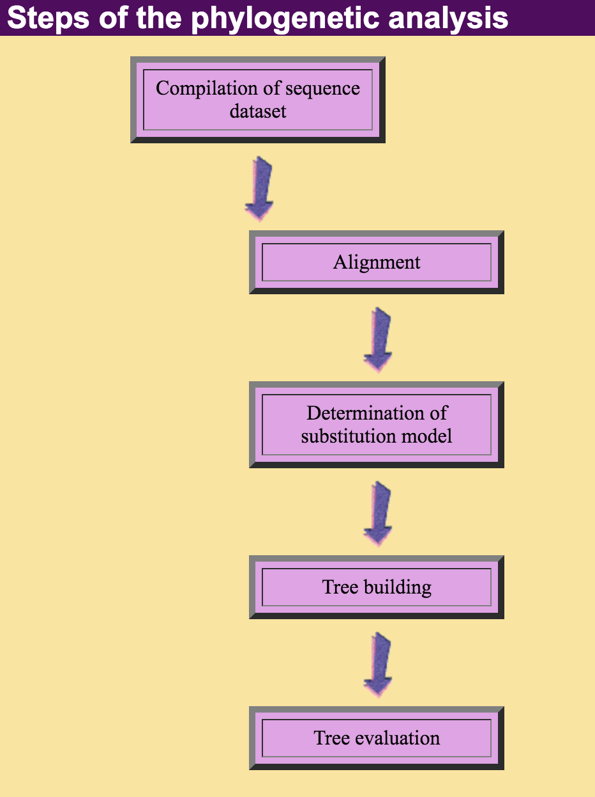

# Week 36 - Tree of life

This week you will have exercises where you should work with testing the best substitution model to use and then you should start building trees using the different classes of tree building methods, the distance based (Neighbourjoining and UPGMA), parsimony and maximum likelihood. You should also bootstrap trees and estimate your confidence in trees using these bootstrap values
Throughout these exercises I recommend that you keep an open word file where you paste all your results to keep a log book of the exercises, including the different trees that you obtain.

## Testing substitution model
Open primates.meg data set which is the one from Chapter 3 in Nei and Kumar. With this data choose Find best model under the Model menu. Run the analysis which will estimate likelihoods for each substitution model available and rank them according to the Bayesian information criterion. For now just accept that the smallest value is best.
1.    Which model is best for this data? Save the Table of model scores since when running some of the tree building methods, you may not be able to use the best model.
2.    What does G and I mean?
3.    What is R? and what is in the 4 columns following the R column?
4.    List the main differences between  JC, Kimura, HKY, and Tamura/Nei models, based on Table 3.2 a,b,e and f in the book. Relate what you find to question 3 above.
From now on, before you start any analysis you are well advised to determine the best substitution model first

## The first phylogeny

First solve Mega tutorial 4, that can be found [here](https://www.dropbox.com/s/g47okbhljlov2e5/Mega%20tutorial%204.docx?dl=0) then:

Reopen flucoding.meg and choose to construct phylogeny
First choose UPGMA with the best substitution model that it allows (UPGMA can not be run with all substitution models).
1.    What does this method assume?
2.    What is bootstrap?
    a.    Choose 1000 bootstrap replicates, what does it then mean if a branch is supported by 90%?
3.    Which substitution model should you use?
4.    Should you use uniform rates?

Build the tree and look at it carefully in the tree explorer

1.    What does it show for flu in cats and dogs
    a.    Does the phylogeny follow H subtypes or species?
2.    Save the tree as a user tree for later use, call it UPGMA
Now repeat the same exercise with

### A.    **Neighbourjoining**
a.    Do you get a similar tree as for UPGMA?
b.    Are bootstrap values similar to the ones from UPGMA?
c.    Try rooting the tree and see how much it can change appearance by rotating on branches and using different displays.

### B.    **Parsimony**
Here you are also estimating the tree by guessing at a good tree followed by close-neighbour interchange. I suggest that you use level 1 which is equivalent to nearest-neighbour interchange. What is this, by the way? I suggest reducing the number of bootstraps to 100 as the method is slower.
a.    How does the Parsimony tree differ from the distance based trees?

### C.    **Maximum likelihood**
a.    Here you should also use fewer bootstrap replicates, because the method is much slower. Remember to save the tree for later use, call it ML
